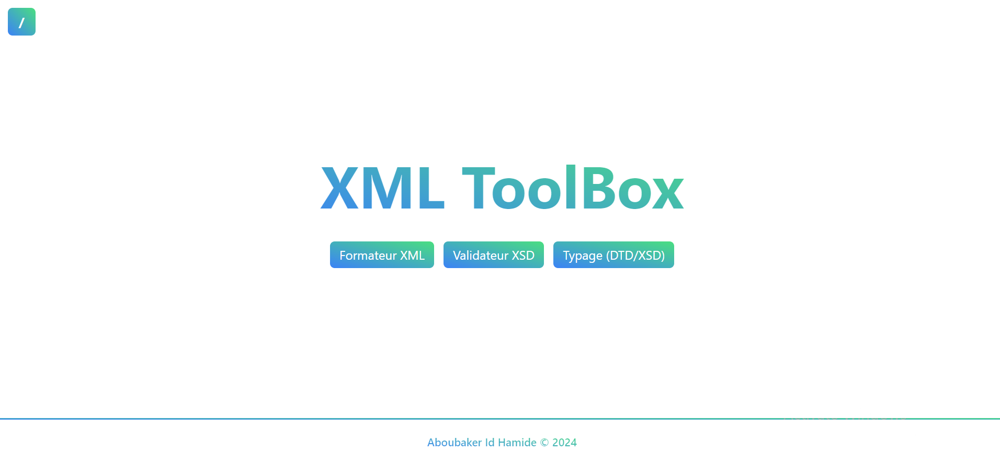
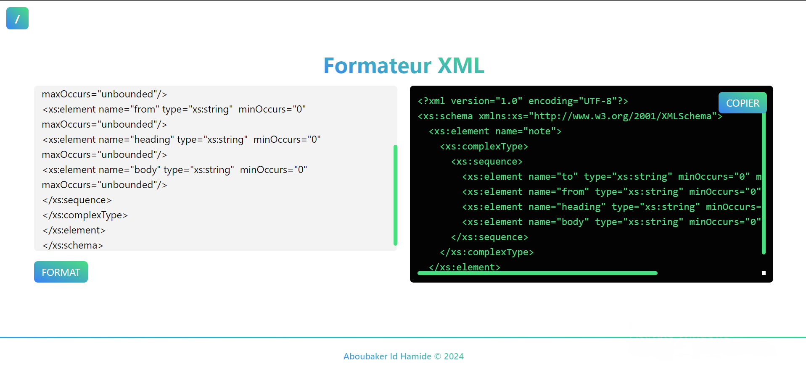
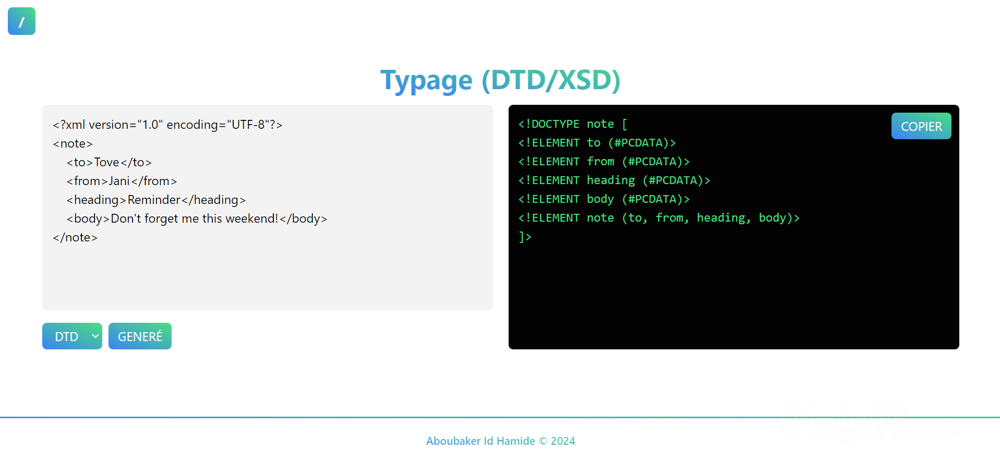

# XML ToolBox
XML Toolbox is an application that offers several functionalities for working with XML files. It includes an XML validator that checks XML validity against XSD schemas, a type generator for creating DTDs or XSDs from user-provided XML, and an XML formatting tool to make your XML more readable.

## Features
1. **XML Validation:** Validates XML against XSD schemas.
2. **Type Generation:** Generates DTDs or XSDs from XML.
3. **XML Formatting:** Reformats XML to improve readability.

## Requirements
- PHP 7.4 or higher
- Web server (e.g., Apache)
- Web browser

## Screenshots

